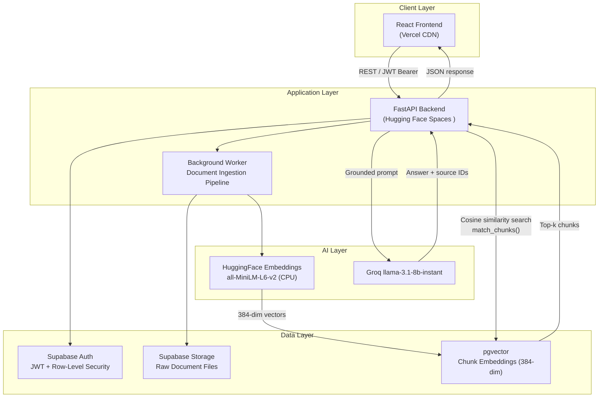

# DocuRAG — Multi-Tenant RAG-as-a-Service Platform

> **Production-ready document intelligence infrastructure.** Upload any document. Get a citation-backed AI chatbot grounded in your own content — deployed in seconds, isolated per tenant, with responses anchored to retrieved source material.

[](https://bezawit-ai-docurag.hf.space)
[](https://docurag-one.vercel.app/)
[](LICENSE)
[](https://python.org)
[](https://fastapi.tiangolo.com)

---

## Executive Summary

DocuRAG is a **multi-tenant Retrieval-Augmented Generation (RAG) platform** that transforms any document corpus into a queryable, AI-powered knowledge base — with database-enforced tenant isolation and citation-backed responses.

Unlike generic LLM chat interfaces, DocuRAG grounds every response in content retrieved from the user's own documents. The LLM receives only the top-k semantically relevant chunks as context, and each answer is returned alongside ranked source excerpts and cosine similarity scores. This retrieval-grounding approach significantly reduces hallucination compared to open-ended LLM prompting — though it does not eliminate it entirely, since the model still reasons over retrieved text and chunk quality directly affects answer quality.

The platform is built for **multi-tenancy from the ground up**: each user's document namespace, vector embeddings, and chat history are isolated at the database layer via Supabase Row-Level Security — not application-layer logic. The architecture supports horizontal scalability across multiple tenants without cross-contamination risk.

---

## What Makes This Different

Most RAG demos are single-user scripts. DocuRAG is a multi-tenant SaaS system. That distinction drives every architectural decision in this codebase.

**1. Per-tenant knowledge isolation, enforced at the database layer**
Each user's documents, chunks, and chat history live in the same PostgreSQL instance — but RLS policies make it structurally impossible for one tenant's queries to touch another's data. This isn't middleware filtering or an `if user_id ==` check in Python. It's a database-engine guarantee that holds even if application code has bugs.

**2. Full system design, not just an AI integration**
This project required designing and wiring together: JWT authentication, file storage, a vector ingestion pipeline, background job processing, cosine similarity retrieval, LLM prompt construction, usage-based billing limits, and a split frontend/backend deployment. That's a SaaS system, not an AI demo.

**3. End-to-end product thinking**
The core user journey is three steps: upload a document → get a public chatbot link → share it. That product simplicity required deliberate decisions about where complexity should live (the backend) and where it shouldn't (the user's experience).

**4. Production deployment practices on a zero budget**
Async background tasks with status polling, per-request client instantiation to prevent credential leakage, IVFFlat indexing for sub-linear retrieval, cold-start handling, and CORS configuration — implemented on free-tier infrastructure without shortcuts in the engineering.

---

## System Architecture



**Request flow summary:** The client authenticates via JWT (Supabase Auth), hits the FastAPI backend, which retrieves semantically similar chunks from pgvector using cosine similarity, constructs a grounded prompt, and dispatches it to Groq's LLaMA 3 — returning the answer alongside ranked source citations.

---

## Technical Deep Dive: The RAG Pipeline

Document ingestion and query resolution follow a deterministic five-stage pipeline:

**Stage 1 — File Extraction**
Uploaded files (PDF, DOCX, TXT) are parsed via PyMuPDF and LangChain document loaders. Raw text is extracted and normalized before any chunking occurs, ensuring layout artifacts and encoding issues are resolved upstream.

**Stage 2 — Semantic Chunking**
Extracted text is split using LangChain's `RecursiveCharacterTextSplitter` with `chunk_size=500` and `chunk_overlap=50`. Overlap preserves semantic continuity at chunk boundaries, preventing retrieval failures on questions that span paragraph transitions.

**Stage 3 — Vector Embedding**
Each chunk is embedded using `sentence-transformers/all-MiniLM-L6-v2`, a 384-dimensional CPU-optimized model. Embeddings are computed locally — no third-party embedding API, no latency introduced by external calls, no additional cost.

**Stage 4 — Cosine Similarity Search**
At query time, the user's question is embedded using the same model. A SQL function (`match_chunks`) performs cosine similarity search over pgvector, returning the top-k chunks by proximity. The IVFFlat index (`lists=100`) ensures sub-linear query time as the chunk corpus scales.

**Stage 5 — LLM Synthesis**
Retrieved chunks are injected into a structured prompt template alongside the original question. Groq's LLaMA 3 (8B or 70B) synthesizes a final answer strictly constrained to the provided context. The response payload includes the answer, ranked source excerpts, similarity scores, and originating document filenames.

---

## Key Engineering Achievements

### Multi-Tenancy and Data Isolation via Row-Level Security

Every sensitive table (`chatbots`, `documents`, `chunks`, `chat_messages`) has Supabase Row-Level Security enabled at the PostgreSQL level. Policies are evaluated by the database engine on every query — not by application logic — making bypass impossible even in the event of application-layer vulnerabilities.

```sql
-- Chunks are only accessible to the chatbot's owner
CREATE POLICY chunk_owner ON public.chunks
FOR ALL USING (
    chatbot_id IN (SELECT id FROM public.chatbots WHERE user_id = auth.uid())
);
```

This architecture means that even if two tenants share the same FastAPI instance, their document embeddings are physically inaccessible to each other. No middleware, no application filtering — the database engine enforces isolation unconditionally.

### Session Isolation and Concurrency Safety

The Supabase client is instantiated per-request using a Factory Pattern rather than as a module-level singleton. This prevents JWT credential leakage across concurrent async handlers in FastAPI's event loop — a common vulnerability in naive multi-tenant implementations where a shared client retains the authentication context of a previous request.

```python
# src/database.py — per-request factory, not module singleton
from supabase import create_client, Client
from src.config import settings

def get_supabase_client(token: str | None = None) -> Client:
    """
    Returns an isolated Supabase client scoped to the current request.
    When a user JWT is provided, RLS policies evaluate against that user's identity.
    Service-role key is reserved for admin-only operations with explicit intent.
    """
    key = token if token else settings.supabase_service_key
    return create_client(settings.supabase_url, key)
```

This pattern eliminates race conditions in high-concurrency scenarios and ensures that each request's database operations are bound to exactly one authentication identity.

### Asynchronous Document Processing

Document ingestion is decoupled from the HTTP response cycle using FastAPI's `BackgroundTasks`. Upload requests return a `202 Accepted` immediately with a poll URL; the ingestion pipeline — extraction, chunking, embedding, and vector insertion — executes asynchronously. Status transitions (`processing` → `ready` | `failed`) are persisted to Supabase and surfaced via a polling endpoint, enabling non-blocking UX for large documents.

### IVFFlat Vector Index for Scalable Retrieval

The `chunks` table uses a pgvector IVFFlat index with cosine distance operators, configured for the 384-dimensional embedding space:

```sql
CREATE INDEX idx_chunks_embedding ON public.chunks
USING ivfflat (embedding vector_cosine_ops) WITH (lists = 100);
```

This index provides approximate nearest-neighbor search with O(√n) query complexity, scaling to millions of chunks before requiring index tuning or architectural changes.

---

## API Reference

| Method | Endpoint | Auth | Description |
|--------|----------|------|-------------|
| `POST` | `/auth/signup` | None | Register a new tenant |
| `POST` | `/auth/login` | None | Authenticate, receive JWT |
| `POST` | `/chatbots` | Bearer JWT | Create an isolated chatbot namespace |
| `GET` | `/chatbots` | Bearer JWT | List chatbots owned by authenticated user |
| `POST` | `/documents/upload` | Bearer JWT | Upload document; returns `202` with poll URL |
| `GET` | `/documents/{id}/status` | Bearer JWT | Poll ingestion status (`processing` / `ready` / `failed`) |
| `POST` | `/chat/{chatbot_slug}` | None (public) | Submit question; returns grounded answer + source citations |

All protected endpoints enforce JWT validation via a FastAPI `Depends` injection. The `/chat/{slug}` endpoint is intentionally unauthenticated to support public-facing chatbot embeds while still enforcing chatbot-level visibility controls via the `is_public` flag and RLS.

---

## Technical Stack

| Layer | Technology | Rationale |
|-------|-----------|-----------|
| API Framework | FastAPI (Python 3.11) | Async-native, automatic OpenAPI docs, typed dependency injection |
| Vector Store | Supabase pgvector | Eliminates separate vector DB infrastructure; RLS applies to embeddings |
| Embeddings | `all-MiniLM-L6-v2` (HuggingFace) | CPU-optimized, 384-dim, no external API dependency |
| LLM Inference | Groq LLaMA 3 (8B / 70B) | Sub-second inference latency; OpenAI-compatible API |
| Database & Auth | Supabase (PostgreSQL + GoTrue) | Row-Level Security, Auth, Storage — unified free-tier platform |
| Frontend | Gradio → React (Vercel) | Rapid prototype to production-grade UI path |
| Deployment — API | Hugging Face Spaces | Zero-cost hosting with persistent subdomain |
| Deployment — UI | Vercel | Global CDN, instant deploys, custom domain |


---

## Deployment Architecture

```
Production Traffic
       │
       ▼
┌─────────────────────┐
│   Vercel CDN        │  ← React frontend, global edge network
│   (Frontend)        │
└──────────┬──────────┘
           │ HTTPS / JWT Bearer
           ▼
┌─────────────────────┐
│   FastAPI Backend   │  ← Hugging Face Spaces (primary) / Render (fallback)
│   (API Server)      │    Auto-restarts on push. 750 hr/month free tier.
└──────────┬──────────┘
           │
    ┌──────┴──────┐
    ▼             ▼
┌────────┐  ┌──────────────────────┐
│ Groq   │  │ Supabase             │
│ LLaMA 3│  │ ├── PostgreSQL + RLS │
│ (LLM)  │  │ ├── pgvector index   │
└────────┘  │ ├── Auth (GoTrue)    │
            │ └── Storage (S3)     │
            └──────────────────────┘
```


---

## Local Development

```bash
# 1. Clone and set up environment
git clone https://github.com/your-username/docurag.git
cd docurag
python -m venv venv && source venv/bin/activate
pip install -r requirements.txt

# 2. Configure environment variables
cp .env.example .env
# Edit .env: GROQ_API_KEY, SUPABASE_URL, SUPABASE_KEY, UPGRADE_URL

# 3. Initialize Supabase schema
# Run the DDL from /docs/schema.sql in the Supabase SQL Editor

# 4. Start the API server
uvicorn main:app --reload --port 8000

# 5. Launch the Gradio UI (development)
API_URL=http://localhost:8000 python app.py
```

**Environment variables required:**

```env
GROQ_API_KEY=gsk_...
SUPABASE_URL=https://your-project.supabase.co
SUPABASE_KEY=eyJ...          # anon key for client operations
SUPABASE_SERVICE_KEY=eyJ...  # service role key for admin operations
UPGRADE_URL=https://your-lemon-squeezy-checkout-url
```

---

## Live Demo

| Environment | URL |
|-------------|-----|
| Frontend (Vercel) | [https://docurag-one.vercel.app/](https://docurag-one.vercel.app/) |
| API Backend (Hugging Face) | [huggingface.co/spaces/Bezawit/DocuRAG](https://huggingface.co/spaces/Bezawit/DocuRAG) |
| API Docs (Swagger UI) | `{backend-url}/docs` |

---

## Project Structure

```
docurag/
├── main.py                  # FastAPI application entry point
├── app.py                   # Gradio UI (Hugging Face Spaces)
├── requirements.txt
├── .env.example
├── src/
│   ├── config.py            # Pydantic settings from environment
│   ├── database.py          # Per-request Supabase client factory
│   ├── auth.py              # JWT verification dependency
│   ├── models.py            # Pydantic request/response schemas
│   ├── ingest.py            # Document → chunks → embeddings → pgvector
│   ├── retrieval.py         # Cosine similarity search via match_chunks()
│   ├── llm.py               # Groq LLaMA 3 prompt construction + inference
│   └── limits.py            # Free tier quota enforcement
├── routers/
│   ├── auth_router.py       # POST /auth/signup, /auth/login
│   ├── chatbot_router.py    # POST /chatbots, GET /chatbots
│   ├── document_router.py   # POST /documents/upload, GET /status
│   └── chat_router.py       # POST /chat/{slug}
├── docs/
│   └── schema.sql           # Full Supabase DDL with pgvector setup
└── tests/
    └── test_rag.py          # Pytest suite: ingestion, retrieval, endpoints
```

---

## Author

**Bezawit Assefa Belete** — AI Architect specializing in RAG systems, multi-tenant SaaS infrastructure, and production LLM deployment.


---

*Built with zero infrastructure budget. Production-grade by design.*
